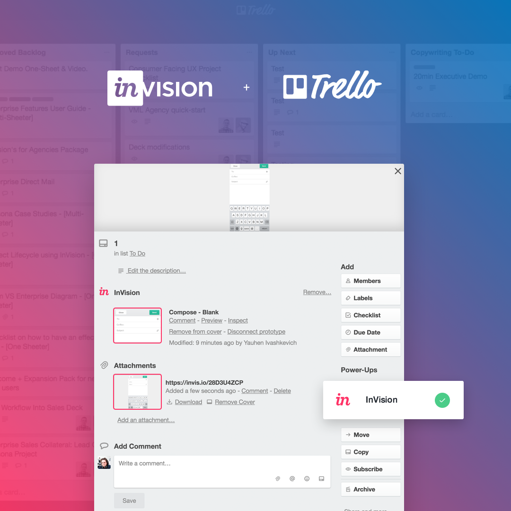

# InVision Trello Power-Up

**[InVision](https://www.invisionapp.com/)** is the world's leading design collaboration platform helping teams of all sizes deliver better digital experiences, faster, together. Millions of customers use InVision to brainstorm, prototype, review, iterate, and test web and mobile designs. InVision is used by over 75% of the Fortune 100 and enables product design at leading companies like Airbnb, Shopify, Salesforce, Disney, Netflix, IBM, Walmart, Apple, and more.

Power-Up is a [React](https://facebook.github.io/react/) application build on top of [Trello API](https://www.google.com.pe/search?q=trello+power+api&rlz=1C5CHFA_enUS756US756&oq=trello+power+api&aqs=chrome..69i57j35i39j69i60l3j35i39.4253j0j4&sourceid=chrome&ie=UTF-8) using [Create React App](https://github.com/facebookincubator/create-react-app).

* Preview InVision prototypes in Trello cards
* Quick access to prototype comments and Inspect
* Prototype screen attached as image

## Development

1. Clone repository `git clone git@github.com:InVisionApp/integration-trello-power-up.git`
2. Install dependencies `yarn install --pure-lockfile`
3. Run webpack development server `npm start`
4. Proxy requests to local environment `ngrok http 3000` (you will need to have [ngrok](https://ngrok.com/) installed)
5. After launching ngrok put adjusted url (https://[Your ngrok ID].ngrok.io/manifest.json) into the prompt on https://trello.com/power-up-preview then you will see a new Power-Up called **InVision** show up in your list of Power-Ups.

## Configuration

Application provides following environment variables for configuration:
* `REACT_APP_CUSTOM_HEAD` - whatever needs to be injected into *HEAD* of the application
* `REACT_APP_CUSTOM_BODY` - whatever needs to be injected into *HEAD* of the application
* `REACT_APP_CLIENT_KEY` - Trello Client Key
* `REACT_APP_PATH_PREFIX` - Hosting path prefix relative to PUBLIC_URL, should have leading and trailing `/`, `/` will be used as a default value
* `REACT_APP_META_URL` - URL of API for fetching public information about shared links
* `REACT_APP_PROJECTS_URL` - URL to InVision projects page

All the abowe variables need to be configured in `.env` file which should be excluded from the repository. To configure the environment variables please follow the [Create React App documentation](https://github.com/facebookincubator/create-react-app/blob/master/packages/react-scripts/template/README.md#adding-custom-environment-variables)

## Testing

`npm run test`
